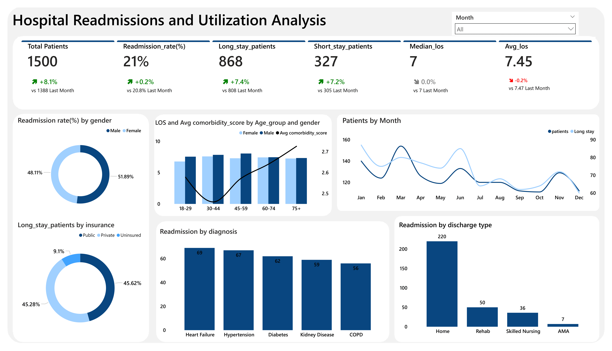

# Hospital Readmissions & Utilization Analytics

## Background and Overview

Hospitals face persistent challenges managing patient readmissions and prolonged hospital stays, both of which increase operational costs and strain bed capacity. This project analyzes 1,500 inpatient encounters to identify clinical and demographic drivers of 30-day readmissions and extended length of stay (LOS). The analysis focuses on operational efficiency and patient outcome monitoring by examining discharge patterns, diagnoses, comorbidity burden, insurance coverage, and demographic characteristics. 

The resulting Power BI dashboard was designed as a single executive reporting page to provide hospital leadership with a consolidated view of hospitalization severity, patient flow trends, and readmission risk indicators.

---

## Data Structure Overview

The dataset contains 1,500 hospital encounter records, with each row representing a unique inpatient admission. Core fields include demographic attributes (age group and gender), clinical variables (primary diagnosis and comorbidity score), operational attributes (insurance type and discharge disposition), and hospitalization metrics such as admission month and length of stay.

Derived columns were created to classify hospitalization duration into short stay (<3 days), medium stay (3–6 days), and long stay (≥7 days). A dedicated date dimension supported monthly trend analysis, while calculated measures were implemented to compute KPIs including readmission rate, LOS statistics, and patient distribution metrics. Relationships were structured to enable cross-filtering across demographics, diagnoses, and operational outcomes.

---

## Technical Stack

- Power BI  
- DAX  
- SQL Server (data storage and preparation)

---

## Executive Summary

The analysis reviewed 1,500 inpatient encounters, identifying 314 readmissions, which represents an overall readmission rate of approximately 21%. Hospitalization duration was relatively extended, with an average LOS of 7.45 days and a median LOS of 7 days, indicating that many patients required prolonged care.

Long-stay patients accounted for 868 encounters (57.87%), significantly outweighing short-stay cases, which represented only 327 patients (21.8%). Diagnosis-level analysis revealed elevated readmission rates among cardiovascular and chronic disease categories, while gender differences remained minimal across most outcome measures. Monthly patient trends showed fluctuating admission volumes, and operational factors such as discharge disposition demonstrated strong associations with readmission outcomes.

---

## Insights Deep Dive

Length-of-stay distribution revealed a heavy concentration of prolonged hospitalizations, with 57.87% of patients classified as long-stay, compared to 21.8% short-stay encounters. Patients aged 45-59 and below demonstrated higher LOS averages, typically 1.4–1.8 days longer than older age groups; patients aged 75+ exhibited higher average comorbidity scores, reinforcing the link between clinical complexity and extended hospital utilization.

Readmission patterns were relatively balanced across gender, with differences typically remaining below 2 percentage points, indicating that gender alone was not a primary driver of hospital returns. Diagnosis-level variation was more pronounced, with chronic cardiovascular and metabolic conditions exceeding the dataset average readmission rate of 21%, highlighting potential targets for care management interventions.

Insurance-level analysis showed that long-stay patients were distributed across payer types with only moderate variation between public and private insurance while the uninsured represented only 9.1%, suggesting that hospitalization duration was driven more strongly by clinical severity than by coverage type. Monthly patient trends remained unstable but within approximately ±10% of average monthly admissions, indicating consistent service demand without significant seasonal fluctuations.

Discharge disposition emerged as one of the strongest operational indicators of readmission risk. It showed that routine home discharges accounted for the highest number of readmissions (220 cases), followed by rehabilitation facilities (50), skilled nursing facilities (36), and discharges against medical advice (7), indicating that absolute readmission volume was concentrated among patients returning home rather than exclusively with post-acute care settings.

---

## Recommendations

Hospitals should prioritize targeted discharge planning and follow-up programs for high-risk diagnoses associated with elevated readmission rates, particularly chronic cardiovascular and metabolic conditions such as heart failure, hypertension and diabetes. Early risk stratification protocols should be implemented for patients projected to exceed seven days of hospitalization, as long-stay patients represent over 57.87% of total encounters and significantly influence bed utilization.

Transitional care coordination should be strengthened for non-routine discharge types, where readmission risk is measurably higher. Monthly operational monitoring should remain embedded within executive dashboards to maintain visibility into patient flow trend, while ongoing tracking of comorbidity burden and LOS trends can help identify emerging clinical risk clusters before they translate into readmissions.
